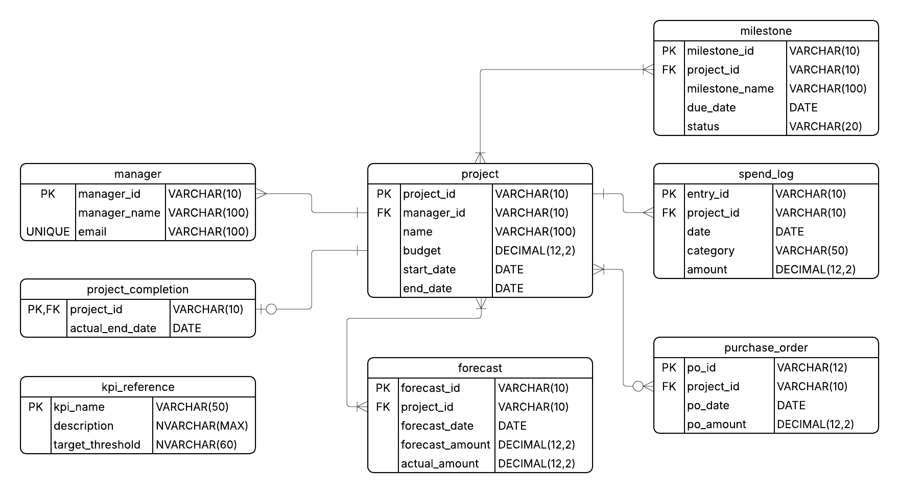

# Finance Reporting (SQL + SSMS) 💼📊

An end-to-end SQL portfolio project that demonstrates **data modeling, idempotent seeding, validation & data-quality checks, and business insights** designed to plug into **Power BI**.

> Tech: Microsoft SQL Server (SSMS). Diagram: Lucidchart (PNG).  
> Scope: Projects/portfolio finance (budgets, spend, milestones, forecasts, purchase orders, completion).

---

## 📦 Repository Structure

```
.
├─ README.md
├─ .gitignore
├─ LICENSE
├─ /sql
│  ├─ 01_create_database.sql
│  ├─ 02_create_table.sql
│  ├─ 03_insert_data.sql
│  ├─ 04_validation_checks.sql
│  ├─ 05_data_quality_checks.sql
│  └─ 06_business_queries.sql
├─ /erd
│  └─ finance_reporting.png   # ERD exported from Lucidchart
└─ /docs
   └─ kpi_reference_explainer.md
```

## 🚀 Quickstart (SSMS)

1. Open **SSMS**, connect to your SQL Server.
2. Run these scripts **in order** (they are idempotent — safe to re-run):
   1. `sql/01_create_database.sql` – creates the **FinanceReporting** database.
   2. `sql/02_create_table.sql` – creates all tables & constraints.
   3. `sql/03_insert_data.sql` – seeds a realistic demo dataset (≈50 projects, managers, spend, milestones, forecasts, POs, completion, KPI glossary).
   4. `sql/04_validation_checks.sql` – referential & logic checks.
   5. `sql/05_data_quality_checks.sql` – duplicates/nulls/outliers sanity checks.
   6. `sql/06_business_queries.sql` – business analysis queries + **KPI views** (Power BI–ready).

---

## 🧩 Data Model (ERD)



**Entities (singular naming):** `manager`, `project`, `spend_log`, `milestone`, `forecast`, `purchase_order`, `project_completion`, `kpi_reference`.

`kpi_reference` is intentionally **standalone** as a **glossary** (see `/docs/kpi_reference_explainer.md`).

---

## 📈 KPI Views (Power BI–ready)

After running `06_business_queries.sql`, reusable views are created (names may vary slightly based on your scripts):

- `v_BudgetUtilization` – cumulative spend vs budget by project.
- `v_ProjectsOnBudget` – projects staying within approved budgets.
- `v_ProjectsOnTime` – on-time delivery based on planned vs actual end dates.

> Connect Power BI to SQL Server (DirectQuery or Import), select the **v_*** views.

---

## 🔍 Data Quality & Trust

- **`04_validation_checks.sql`** – verifies referential integrity, date ranges, and other invariants.
- **`05_data_quality_checks.sql`** – inspects duplicates, nulls, and improbable values (designed to return **no rows** if clean).

---

## 🧾 Table Summary

| Table | Highlights |
|------|------------|
| `manager` | People accountable for projects (unique email, PK `manager_id`). |
| `project` | Portfolio view: budget, start/end dates, and FK to manager. |
| `spend_log` | Transaction-level spend entries with category + date. |
| `milestone` | Project checkpoints with status and due date. |
| `forecast` | Periodic forecasts vs. actuals for each project. |
| `purchase_order` | Commitments raised prior to spend hitting the ledger. |
| `project_completion` | Actual completion date (1:1 with project). |
| `kpi_reference` | **Glossary** of KPI definitions & targets (documentation-first). |

---

## 🗺️ What This Demonstrates

- **Schema design** with clear accountability and analysis tables.  
- **Idempotent DDL/DML** with readable prints and guards.  
- **Validation + quality** checks for trustworthy analytics.  
- **Business queries** and **KPI views** that feed BI tools.  
- A polished **ERD** and documentation for non-technical audiences.

---

## 🧭 Roadmap

- Optional `kpi_result` or `project_kpi` table to store KPI values over time.
- Earned value & benefit realization tables (for CPI/SPI/ROI).
- Indexes and performance tuning as dataset scales.

---

## 📜 License

This project is open-sourced under the **MIT License** (see `LICENSE`).

## Acknowledgments
Some parts of the SQL scripts were generated with the assistance of OpenAI Codex.  
All scripts were reviewed, refined, and finalized by Arun Acharya.


